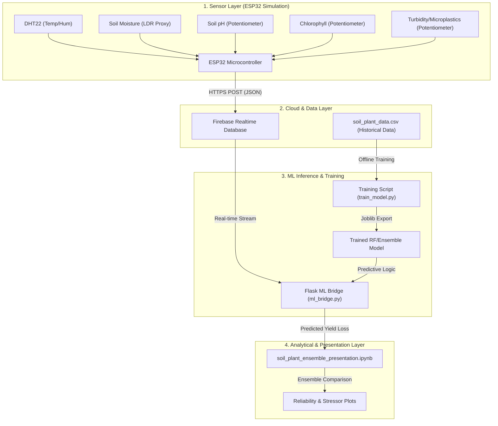

# System Architecture: Soil-Plant Physiological Coupling

This diagram illustrates the flow of data from physical sensor simulation (ESP32) through our real-time ML inference bridge to the final analytical presentation layer.

### Component Overview:
- **Sensor Layer**: Simulates agricultural conditions using ESP32 and electronic components.
- **Cloud Layer**: Centralized data sync via Firebase ensures low-latency access for the ML bridge.
- **Intelligence Layer**: The heart of the system, transforming raw sensor values into actionable agricultural insights (Yield Loss %).
- **Presentation Layer**: A high-impact visualization suite for stakeholders to evaluate model reliability and sensor sensitivity.
